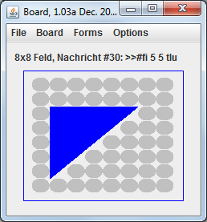

# board-of-symbols (BoS)
Board of Symbols (BoS) is a project for teaching (learning) C or Java programming.

 for( x=1; x<6;  x++ ) {
 
    for( y=x; y<6; y++ ) {
       farbe2( x, y, BLUE )
       if( x == y ) {
          form2( x, y, "tlu" )
       } else {
          form2( x, y, "s" )
       }
    }
  }
 

## How to start - Java:
- download the file jserver.jar 
- if necessary - install java SDK
- run jserver.jar ( double click or via commandline: java -jar jserver.jar ) 
- then open a code window (menu "Fenster für Code-Eingabe" or ALT-c) to enter some Java code
- if javac is not found: add the sdk to the PATH or set the directory name (bin) in the properties menu in CodeWindow

A short video with the first steps: https://www.youtube.com/watch?v=VLVigtQNIeU&feature=youtu.be

## How to start - C
## Getting Started on OS X

See the [guide for installing on OS X](documentation/installing-on-os-x.md).

## Getting Started on Windows

- download the zip-archive
- unzip the archive
- make sure to have the JRE installed
- if necessary - install gcc (GNU C compiler) via MinGW or Microsoft Visual Studio)
- run jserver.jar ( double click or via commandline: java -jar jserver.jar ) 
- then open a code window (menu "Fenster für Code-Eingabe") to enter some C code

## For Visual Studio Compiler users:

in order to execute the compile and link command cl some environment variables have to be set. The program reads these variables from the file vc.properties. You can build a version for your system as follows:

- open a command window
- go to the Visual Studio directories and run vsvarsall.bat script 
- in the command window return to the jserver directory
- type: set > vc.properties 
- open this file in an editor and replace all backslashs \  with double backslashs \\\\ 

## Integration in a Visual Studio project: 

In the directory *applicaton_vs* you find all required .cpp and .h files. Copy them into your project folder. Afterwards please add all these files in Visual Studio within your projects header and source folders. Make sure to replace the stdafx.h file with the one you find in the *application_vs* folder.

## Integration in an Xcode project:

In Xcode, create a new CommandLine Application as C++ and simply drop in all necessary files. If asked, please be sure to set the checkbox “Copy files if needed”.

## Integration in a MINGW project:

When using MINGW, please add the following files (expecting the installation folder was C:\MinGW\) in this given order to your linker objects/files:

 - "C:\MinGW\lib\libws2_32.a"
 - "C:\MinGW\lib\libmswsock.a"
 - "C:\MinGW\lib\libadvapi32.a"
 
#### For Eclipse C++: 

Right click on your project -> Properties -> C/C++ Build -> Settings -> "Tool Settings" -> MinGW C++ Linker -> Miscellaneous -> "Other objects" (lower part) -> Add object

#### For DEV C++:

At the moment not possible.

#### Netbeans C++:

To be done.

### CodeBlocks:

To be done.
